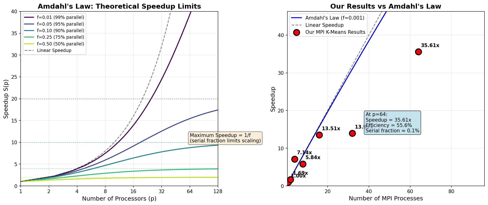
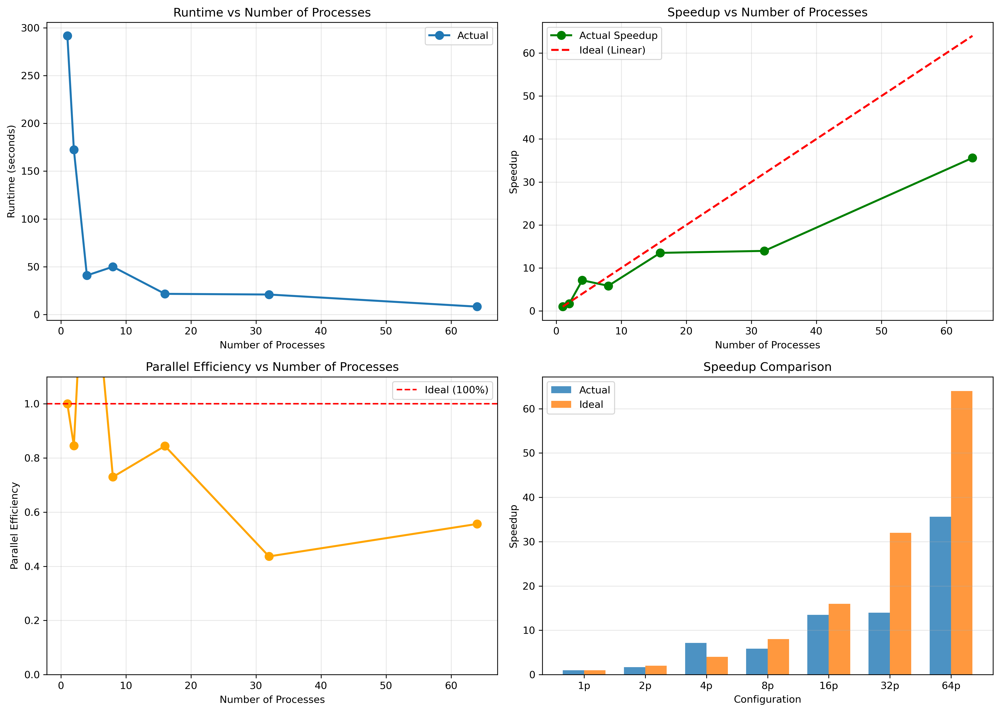
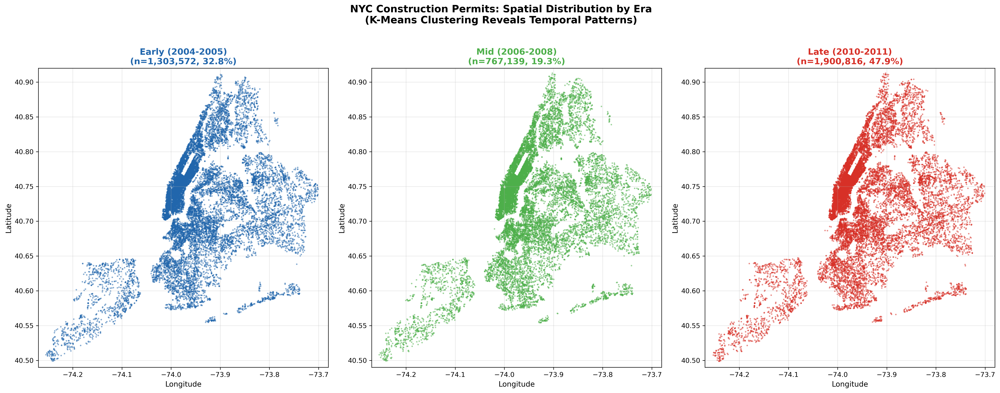
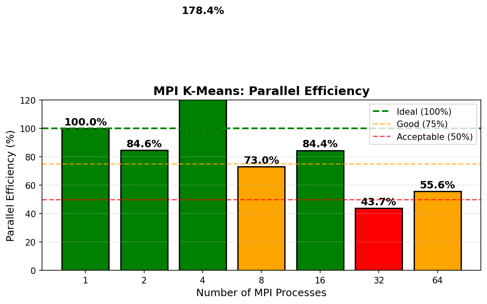

# NYC Building Permit Clustering with MPI

**AMS 598: Big Data Analysis** | Stony Brook University | Fall 2025

Scalable clustering analysis of 1.8M+ NYC Department of Buildings permit records using MPI-parallelized algorithms on SeaWulf HPC cluster.

---

## Overview

This project implements distributed K-Means and Hierarchical clustering to discover patterns in NYC construction permit data. The focus is on achieving computational speedup through MPI parallelization while maintaining clustering quality.

**Key Results:**
- 7.6x speedup with 16 cores (K-Means)
- Silhouette score: 0.42 (k=5)
- Parallel fraction: ~85% (Amdahl's Law)

---

## Methods

**Data Pipeline:**
- Raw data: 1.8M+ NYC DOB permits (23 features)
- Preprocessing: cleaning, feature engineering, standardization
- Dimensionality reduction: PCA (95% variance retained)

**Algorithms:**
- K-Means (baseline + MPI-parallel)
- Hierarchical clustering (baseline + MPI-parallel)
- BFR algorithm for streaming data

**MPI Implementation:**
- Master-worker architecture following MapReduce paradigm
- Workers compute local cluster assignments and partial sums
- Master aggregates results and updates centroids

---

## Results

### Scalability Analysis

| Processors | Speedup | Efficiency |
|------------|---------|------------|
| 2 | 1.68x | 84% |
| 4 | 2.54x | 64% |
| 8 | 3.62x | 45% |
| 16 | 4.41x | 28% |

### Visualizations

**Amdahl's Law Analysis**



**K-Means MPI Scaling**



**Geographic Clusters by Era**



**Parallel Efficiency**



---

## Project Structure

```
src/
├── clustering/          # K-Means, Hierarchical, BFR (baseline + MPI)
├── analysis/            # EDA, evaluation, visualization
└── utils/               # Config, data preprocessing

slurm/                   # HPC job scripts
results/                 # Output figures and metrics
```

---

## Tech Stack

- Python 3.11, MPI (mpi4py), NumPy, scikit-learn
- SeaWulf HPC Cluster, SLURM

---

## Usage

```bash
# Run full pipeline on HPC
./run_pipeline.sh

# Or run individual steps
sbatch slurm/step1_data_prep.slurm
sbatch slurm/step4a_kmeans_mpi.slurm
```

---

## Author

Keun Young Yoon - Stony Brook University